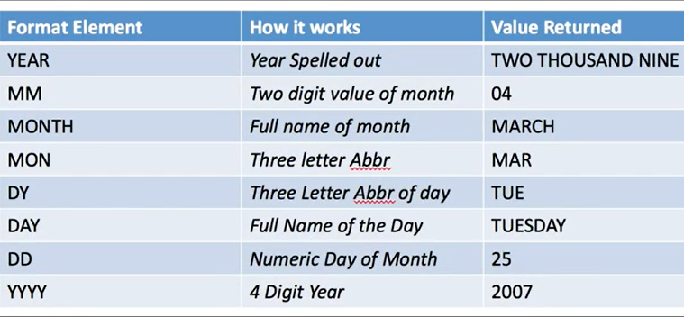
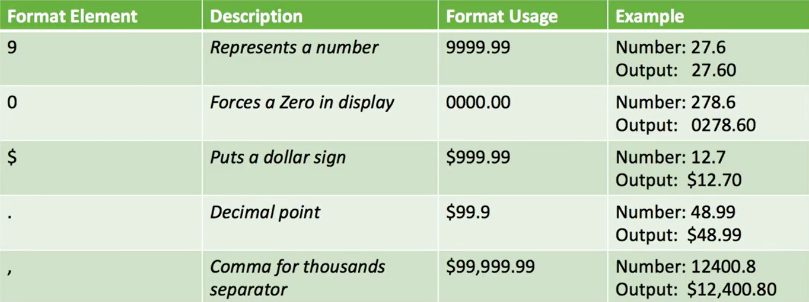

## SQL Workshop

 * [SQL Development Environment](https://apex.oracle.com/pls/apex/f?p=4550:1:115730555810709:) 
 
### Some useful resources 
* Date format conversion
 

* Number format conversion
 

### Datasets
 * [OpenAQ Global Air Pollution Measurements](https://www.kaggle.com/open-aq/openaq?utm_medium=email&utm_source=mailchimp&utm_campaign=sql+scav+hunt) 
